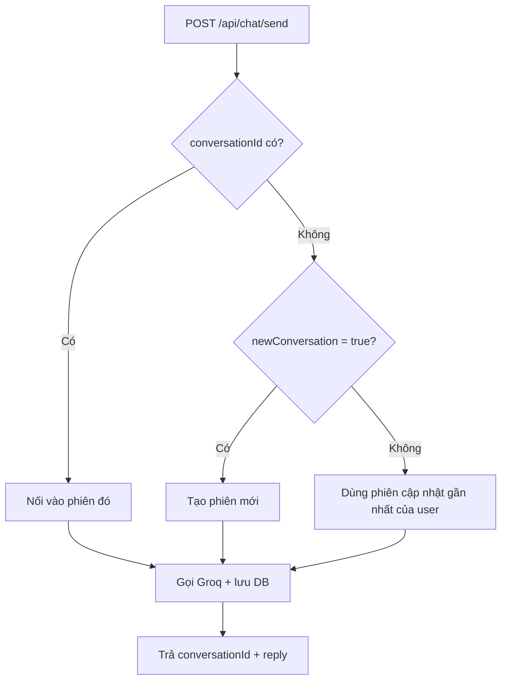

# JP ChatBuddy — Tài liệu API Backend

Tài liệu mô tả toàn bộ REST API hiện tại của backend JP ChatBuddy (Express + MongoDB + Groq AI).

---

## Thông tin chung

| Mục | Giá trị |
|-----|---------|
| **Base URL** | `http://localhost:3000` (mặc định, cấu hình qua `PORT` trong `.env`) |
| **Prefix API** | `/api` |
| **Định dạng** | JSON (`Content-Type: application/json`) |
| **Giới hạn body** | 50 KB |
| **Rate limit** | 60 request / phút / IP (toàn server) |

### Header bắt buộc

```http
Content-Type: application/json
```

### Xác thực JWT (các route được bảo vệ)

```http
Authorization: Bearer <jwt-token>
```

Token nhận được từ `POST /api/auth/register` hoặc `POST /api/auth/login`.  
Mặc định hết hạn sau **7 ngày** (`JWT_EXPIRES_IN` trong `.env`).

### Mã trạng thái HTTP thường gặp

| Mã | Ý nghĩa |
|----|---------|
| `200` | Thành công |
| `201` | Tạo mới thành công |
| `400` | Thiếu/sai dữ liệu đầu vào |
| `401` | Chưa đăng nhập hoặc token không hợp lệ |
| `404` | Không tìm thấy tài nguyên |
| `429` | Vượt rate limit (hoặc Groq quá tải — xem message chat) |
| `500` | Lỗi server / AI |

---

## Tổng quan endpoint

| Method | Path | Auth | Mô tả |
|--------|------|------|--------|
| `GET` | `/health` | Không | Kiểm tra server |
| `POST` | `/api/auth/register` | Không | Đăng ký |
| `POST` | `/api/auth/login` | Không | Đăng nhập |
| `POST` | `/api/chat/send` | Có | Gửi tin nhắn tới AI (Konny) |
| `GET` | `/api/chat/history` | Có | Lấy lịch sử tin nhắn |
| `GET` | `/api/chat/conversations` | Có | Danh sách phiên trò chuyện |
| `POST` | `/api/vocabulary/add` | Có | Thêm từ vựng |
| `GET` | `/api/vocabulary/all` | Có | Lấy tất cả từ vựng |
| `DELETE` | `/api/vocabulary/:id` | Có | Xóa từ vựng |
| `POST` | `/api/grammar/check` | Không | Kiểm tra nhiệm vụ ngữ pháp |

---

## Health Check

### `GET /health`

Kiểm tra nhanh server có đang chạy hay không.

**Response `200`**

```text
API is running...
```

*(Plain text, không phải JSON.)*

---

## Authentication

### `POST /api/auth/register`

Tạo tài khoản mới và trả về JWT.

**Request body**

| Trường | Kiểu | Bắt buộc | Mô tả |
|--------|------|----------|--------|
| `username` | string | Có | Tên hiển thị |
| `email` | string | Có | Email (duy nhất) |
| `password` | string | Có | Mật khẩu (lưu bcrypt) |

```json
{
  "username": "testuser",
  "email": "testuser@example.com",
  "password": "Password123!"
}
```

**Response `201`**

```json
{
  "success": true,
  "user": {
    "id": "665a1b2c3d4e5f6789012345",
    "email": "testuser@example.com",
    "username": "testuser",
    "createdAt": "2026-05-17T10:00:00.000Z"
  },
  "token": "eyJhbGciOiJIUzI1NiIsInR5cCI6IkpXVCJ9..."
}
```

**Lỗi**

| Mã | Body ví dụ |
|----|------------|
| `400` | `{ "success": false, "message": "Missing fields..." }` |
| `400` | `{ "success": false, "message": "Email already registered" }` |

---

### `POST /api/auth/login`

Đăng nhập và nhận JWT.

**Request body**

| Trường | Kiểu | Bắt buộc |
|--------|------|----------|
| `email` | string | Có |
| `password` | string | Có |

```json
{
  "email": "testuser@example.com",
  "password": "Password123!"
}
```

**Response `200`**

```json
{
  "success": true,
  "user": {
    "id": "665a1b2c3d4e5f6789012345",
    "email": "testuser@example.com",
    "username": "testuser"
  },
  "token": "eyJhbGciOiJIUzI1NiIsInR5cCI6IkpXVCJ9..."
}
```

**Lỗi**

| Mã | Body ví dụ |
|----|------------|
| `400` | `{ "success": false, "message": "Missing fields..." }` |
| `401` | `{ "success": false, "message": "Invalid credentials" }` |

**Payload JWT** (sau khi decode): `{ id, email, username }` — middleware gắn `req.user.id` từ trường `id`.

---

## Chat

Tất cả route dưới `/api/chat` yêu cầu header `Authorization: Bearer <token>`.

Dữ liệu chat lưu theo model **Conversation**: mỗi user có thể có nhiều phiên; mỗi phiên chứa mảng `messages` (user / assistant).

### Luồng chọn phiên khi gửi tin



---

### `POST /api/chat/send`

Gửi tin nhắn tới AI **Konny** (tiếng Nhật, persona tiểu quỷ). Lưu tin user + phản hồi assistant vào DB.

**Request body**

| Trường | Kiểu | Bắt buộc | Mô tả |
|--------|------|----------|--------|
| `message` | string | Có* | Nội dung tin nhắn user |
| `conversationId` | string | Không | ID phiên hiện có — nối tin vào phiên này |
| `newConversation` | boolean | Không | `true` → tạo phiên mới (khi không có `conversationId`) |
| `quote` | string \| null | Không | Văn bản trích dẫn từ trang web (extension gửi khi giải thích selection) |

\*Controller không validate rỗng; nên client luôn gửi `message` có nội dung.

```json
{
  "message": "この文法を教えて",
  "conversationId": "665a1b2c3d4e5f6789012345",
  "quote": "食べる",
  "newConversation": false
}
```

**Ví dụ — phiên trò chuyện mới**

```json
{
  "message": "こんにちは",
  "newConversation": true
}
```

**Response `200`**

```json
{
  "conversationId": "665a1b2c3d4e5f6789012345",
  "reply": "やあ、何か用かい？😈"
}
```

**Ghi chú hành vi**

- Có `quote`: AI nhận prompt ghép `【DỮ LIỆU TRÍCH DẪN】` + `【CÂU HỎI CỦA USER】`; DB chỉ lưu `message` gốc (không lưu quote trong lịch sử).
- Context AI: tối đa **10 tin** gần nhất trong phiên.
- `conversationId` không thuộc user → có thể không tìm thấy phiên (hành vi phụ thuộc DB).

**Lỗi**

| Mã | Body ví dụ |
|----|------------|
| `401` | `{ "success": false, "message": "Unauthorized" }` |
| `500` | `{ "error": "Internal Server Error", "detail": "Konny bận quậy rồi!", "type": "Error" }` |

---

### `GET /api/chat/history`

Lấy danh sách tin nhắn (dạng đã map cho UI extension).

**Query parameters**

| Tham số | Kiểu | Mặc định | Mô tả |
|---------|------|----------|--------|
| `limit` | number | `20` | Số tin nhắn tối đa (lấy từ cuối mảng) |
| `conversationId` | string | — | ID phiên cụ thể. Bỏ qua → phiên **cập nhật gần nhất** của user |

**Ví dụ**

```http
GET /api/chat/history?limit=10&conversationId=665a1b2c3d4e5f6789012345
Authorization: Bearer <token>
```

**Response `200`**

```json
[
  {
    "id": "665a1b2c3d4e5f678901234a",
    "content": "こんにちは",
    "isChatBot": false
  },
  {
    "id": "665a1b2c3d4e5f678901234b",
    "content": "やあ！😈",
    "isChatBot": true
  }
]
```

| Trường | Mô tả |
|--------|--------|
| `id` | ID tin nhắn (hoặc id tạm nếu subdocument chưa có `_id`) |
| `content` | Nội dung |
| `isChatBot` | `true` = assistant (Konny), `false` = user |

Phiên không tồn tại hoặc chưa có tin → `[]`.

**Lỗi**

| Mã | Body ví dụ |
|----|------------|
| `401` | `{ "success": false, "message": "Unauthorized" }` |
| `500` | `{ "error": "Failed to fetch history", "detail": "..." }` |

---

### `GET /api/chat/conversations`

Danh sách các phiên trò chuyện của user, **mới nhất trước**.

**Query parameters**

| Tham số | Kiểu | Mặc định | Mô tả |
|---------|------|----------|--------|
| `limit` | number | `10` | Số phiên tối đa |

**Ví dụ**

```http
GET /api/chat/conversations?limit=10
Authorization: Bearer <token>
```

**Response `200`**

```json
[
  {
    "id": "665a1b2c3d4e5f6789012345",
    "preview": "こんにちは",
    "updatedAt": "2026-05-17T12:30:00.000Z",
    "messageCount": 4
  },
  {
    "id": "665a1b2c3d4e5f6789012340",
    "preview": "Phiên mới",
    "updatedAt": "2026-05-17T11:00:00.000Z",
    "messageCount": 0
  }
]
```

| Trường | Mô tả |
|--------|--------|
| `id` | ID phiên (`conversationId` dùng cho `/send` và `/history`) |
| `preview` | 24 ký tự đầu của tin user cuối; hoặc `"..."` / `"Phiên mới"` |
| `updatedAt` | Thời điểm cập nhật phiên |
| `messageCount` | Tổng số tin (user + assistant) |

**Lỗi**

| Mã | Body ví dụ |
|----|------------|
| `401` | `{ "success": false, "message": "Unauthorized" }` |
| `500` | `{ "error": "Failed to fetch conversations", "detail": "..." }` |

---

## Vocabulary

Tất cả route dưới `/api/vocabulary` yêu cầu JWT. Mỗi từ vựng gắn với `user` đăng nhập.

### `POST /api/vocabulary/add`

Thêm một mục từ vựng.

**Request body**

| Trường | Kiểu | Bắt buộc | Mô tả |
|--------|------|----------|--------|
| `word` | string | Có | Từ (thường là tiếng Nhật) |
| `meaning` | string | Có | Nghĩa / ghi chú |
| `date` | string (ISO) | Không | Ngày lưu; mặc định `Date.now()` |

```json
{
  "word": "こんにちは",
  "meaning": "Xin chào"
}
```

**Response `201`**

```json
{
  "_id": "665a1b2c3d4e5f6789012345",
  "user": "665a00000000000000000001",
  "word": "こんにちは",
  "meaning": "Xin chào",
  "date": "2026-05-17T10:00:00.000Z",
  "__v": 0
}
```

**Lỗi**

| Mã | Body ví dụ |
|----|------------|
| `400` | `{ "message": "Word and meaning are required" }` |
| `401` | `{ "message": "Unauthorized" }` |
| `500` | `{ "message": "Error adding vocabulary", "error": ... }` |

---

### `GET /api/vocabulary/all`

Lấy toàn bộ từ vựng của user hiện tại.

**Response `200`**

```json
[
  {
    "_id": "665a1b2c3d4e5f6789012345",
    "user": "665a00000000000000000001",
    "word": "こんにちは",
    "meaning": "Xin chào",
    "date": "2026-05-17T10:00:00.000Z",
    "__v": 0
  }
]
```

**Lỗi**

| Mã | Body ví dụ |
|----|------------|
| `401` | `{ "message": "Unauthorized" }` |
| `500` | `{ "message": "Error fetching vocabularies", "error": ... }` |

---

### `DELETE /api/vocabulary/:id`

Xóa từ vựng theo `_id` (chỉ nếu thuộc user đang đăng nhập).

**Ví dụ**

```http
DELETE /api/vocabulary/665a1b2c3d4e5f6789012345
Authorization: Bearer <token>
```

**Response `200`**

```json
{
  "message": "Xóa thành công",
  "id": "665a1b2c3d4e5f6789012345"
}
```

**Lỗi**

| Mã | Body ví dụ |
|----|------------|
| `400` | `{ "message": "ID is required" }` |
| `401` | `{ "message": "Unauthorized" }` |
| `404` | `{ "message": "Không tìm thấy từ vựng để xóa" }` |
| `500` | `{ "message": "Lỗi khi xóa từ vựng", "error": ... }` |

---

## Grammar

### `POST /api/grammar/check`

Kiểm tra nhiệm vụ ngữ pháp dựa trên tin nhắn **user** trong phiên chat có `updatedAt` từ **8:00 sáng hôm nay** trở đi.

**Không yêu cầu JWT** (public).

**Request body**

| Trường | Kiểu | Bắt buộc | Mô tả |
|--------|------|----------|--------|
| `missions` | array | Có | Danh sách nhiệm vụ ngữ pháp |

Mỗi phần tử `missions` (theo extension):

| Trường | Kiểu | Mô tả |
|--------|------|--------|
| `id` | string | Mã ngữ pháp (vd. `JLPT42`) |
| `name` | string | Tên cấu trúc |
| `meaning` | string | Giải thích |
| `status` | boolean | Đã hoàn thành hay chưa |

```json
{
  "missions": [
    {
      "id": "JLPT42",
      "name": "〜ている",
      "meaning": "Đang làm gì đó",
      "status": false
    },
    {
      "id": "JLPT10",
      "name": "〜たい",
      "meaning": "Muốn làm gì",
      "status": true
    }
  ]
}
```

**Response `200`**

```json
{
  "missions": [
    {
      "id": "JLPT42",
      "name": "〜ている",
      "meaning": "Đang làm gì đó",
      "status": true
    },
    {
      "id": "JLPT10",
      "name": "〜たい",
      "meaning": "Muốn làm gì",
      "status": true
    }
  ],
  "message": "Đã cập nhật: Bạn đã hoàn thành thêm 1 ngữ pháp mới!"
}
```

**Các `message` đặc biệt (không lỗi HTTP)**

| `message` | Ý nghĩa |
|-----------|---------|
| `"Không có dữ liệu chat mới từ 8h sáng."` | Không có conversation cập nhật sau 8h |
| `"Bạn chưa gửi tin nhắn nào sau 8h sáng để kiểm tra."` | Có phiên nhưng chưa có tin user sau 8h |
| `"Nội dung không có gì thay đổi"` | AI không đánh dấu thêm nhiệm vụ nào |

**Lỗi**

| Mã | Body ví dụ |
|----|------------|
| `400` | `{ "error": "Missions array is required" }` |
| `500` | `{ "error": "Internal server error" }` |

---

## Lỗi xác thực chung (middleware)

Khi gọi route bảo vệ mà thiếu/sai token:

| Mã | `message` |
|----|-----------|
| `401` | `"No token"` |
| `401` | `"Invalid token"` |

---

## Rate limiting

Khi vượt **60 request/phút**:

```json
{
  "message": "Quá nhiều yêu cầu, vui lòng thử lại sau 1 phút."
}
```

HTTP status: `429 Too Many Requests`.

---

## Biến môi trường (tham khảo)

| Biến | Mô tả |
|------|--------|
| `PORT` | Cổng server (mặc định `3000`) |
| `MONGODB_URI` | Chuỗi kết nối MongoDB |
| `JWT_SECRET` | Khóa ký JWT |
| `JWT_EXPIRES_IN` | Thời hạn token (mặc định `7d`) |
| `GROQ_API_KEY` | API key Groq (chat + grammar) |
| `GROQ_MODEL` | Model Groq (trong `config/groq.ts`) |

---

## Hướng dẫn tích hợp Extension

1. **Lưu token** sau login/register vào `localStorage` (key `token`).
2. **Mọi request** tới `/api/chat/*` và `/api/vocabulary/*` gửi kèm `Authorization: Bearer ${token}`.
3. **Phiên chat mới**
   - Gọi `GET /api/chat/conversations` để hiển thị danh sách phiên.
   - Khi user bấm "Phiên mới": gửi tin với `newConversation: true` (không cần `conversationId`).
   - Sau `POST /send`, lưu `conversationId` trả về cho các tin tiếp theo.
4. **Xem lịch sử phiên cũ**: `GET /api/chat/history?conversationId=<id>&limit=10`.
5. **Giải thích văn bản bôi đen**: gửi `quote` + `message` trong cùng một request `/api/chat/send`.
6. **Base URL extension** (hiện tại): `http://localhost:3000/api` — cấu hình trong `Extension/src/services/api.ts`.

### Ví dụ curl

**Đăng nhập**

```bash
curl -X POST http://localhost:3000/api/auth/login \
  -H "Content-Type: application/json" \
  -d "{\"email\":\"test@example.com\",\"password\":\"secret\"}"
```

**Gửi tin (phiên mới)**

```bash
curl -X POST http://localhost:3000/api/chat/send \
  -H "Content-Type: application/json" \
  -H "Authorization: Bearer YOUR_TOKEN" \
  -d "{\"message\":\"こんにちは\",\"newConversation\":true}"
```

**Danh sách phiên**

```bash
curl http://localhost:3000/api/chat/conversations \
  -H "Authorization: Bearer YOUR_TOKEN"
```

---

## Phiên bản tài liệu

- **Cập nhật:** 2026-05-17  
- **Khớp codebase:** backend `chatRoutes` gồm `/send`, `/history`, `/conversations`
